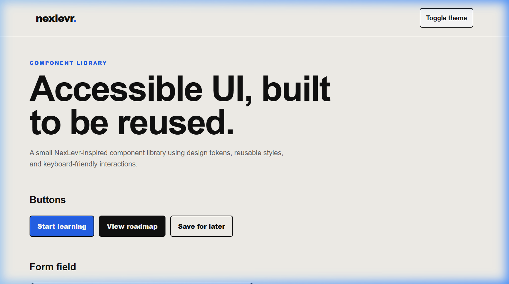
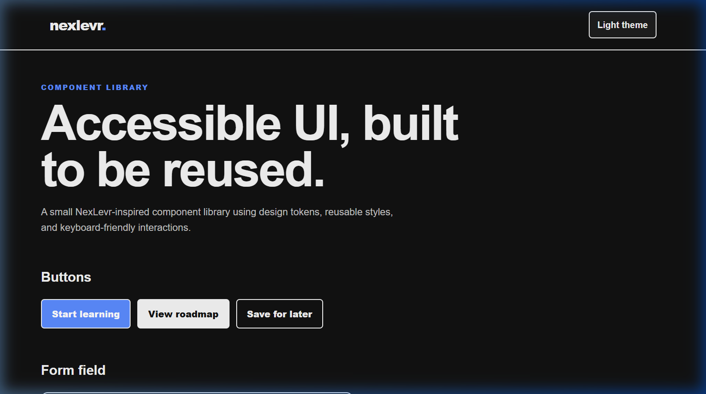
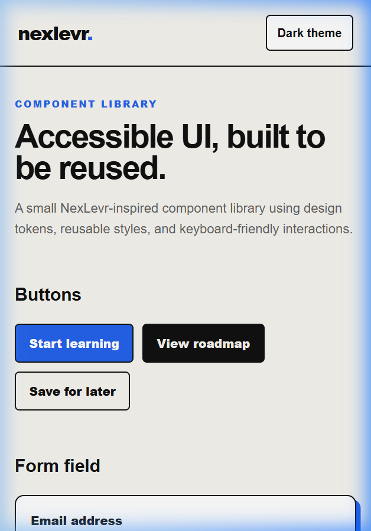
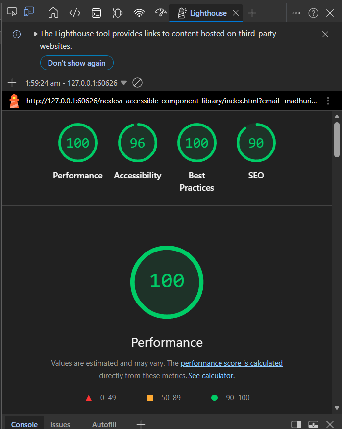
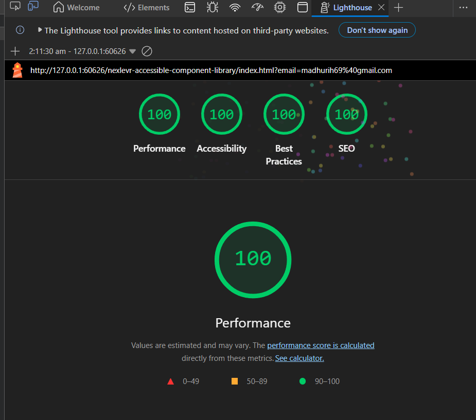

## Level 2

# NexLevr Accessible Component Library

A small, responsive, and accessible UI component library built with HTML, CSS, and JavaScript as part of the NexLevr Frontend Developer proof-of-work task.

## Overview

This project demonstrates reusable UI components built with a consistent theme system and accessibility-focused interactions.

The demo includes light and dark themes, reusable buttons, a form field, cards, and a status message.

## Features

- Light and dark theme toggle
- CSS design tokens using custom properties
- Reusable button variants
- Accessible email input field with label and helper text
- Responsive card layout
- Status message for form submission feedback
- Keyboard-visible focus states
- Responsive design for desktop and mobile screens

## Components Included

- Primary button
- Secondary button
- Outline button
- Theme toggle button
- Email form field
- Learning cards
- Status alert message

## Accessibility Features

- Semantic HTML structure using `header`, `main`, `section`, `article`, and `form`
- Proper heading hierarchy
- Input label connected using `for` and `id`
- Keyboard navigation support
- Visible `:focus-visible` outlines
- Theme toggle uses `aria-pressed`
- Theme toggle `aria-label` updates based on the active theme
- Status message uses `role="status"`
- Form submission updates the status message without refreshing the page

## Design Tokens

The project uses CSS variables to keep the design consistent and reusable.

Examples include:

````css
--bg
--surface
--text
--primary


Built With
HTML5
CSS3
JavaScript
CSS Custom Properties
CSS Grid
Flexbox
Media Queries
Project Structure
nexlevr-accessible-component-library/
│── index.html
│── style.css
│── script.js
└── README.md


Screenshots

Add your screenshots inside a screenshots folder, then update these file names if needed:




Learning Outcomes

Through this project, I practiced:

Creating reusable UI components
Using design tokens with CSS variables
Building light and dark themes
Adding accessible keyboard focus states
Using ARIA attributes appropriately
Creating responsive layouts with CSS Grid and media queries
Handling form submission feedback with JavaScript


## Lighthouse Optimization

This project was audited using Chrome Lighthouse and improved based on the audit results.

| Category       | Before | After |
| -------------- | -----: | ----: |
| Performance    |    100 |   100 |
| Accessibility  |     96 |   100 |
| Best Practices |    100 |   100 |
| SEO            |     90 |   100 |

### Improvements Made

- Improved color contrast for text inside the featured card.
- Added a descriptive page title.
- Added a meta description for better search-engine understanding.
- Re-ran Lighthouse to verify the improvements.

# Lighthouse Screenshots

Add your screenshots inside the `screenshots` folder:

```md


```
````
